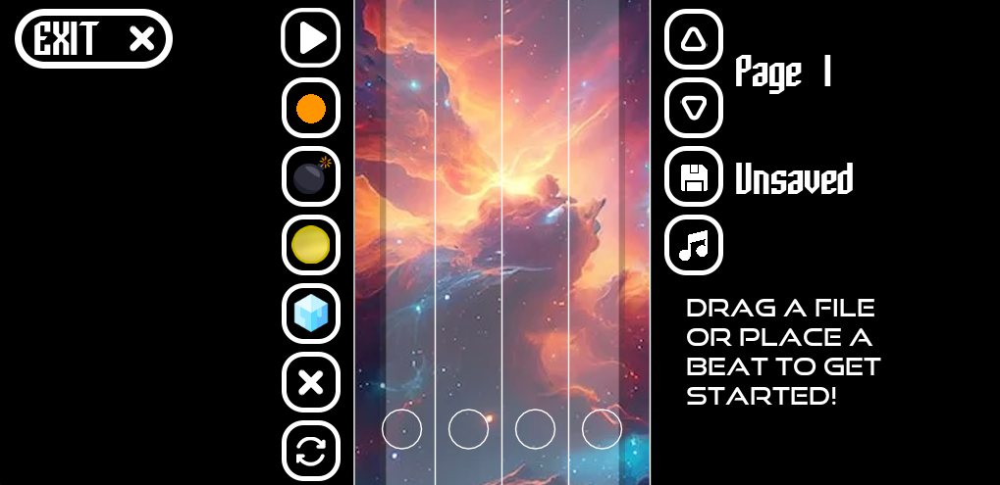
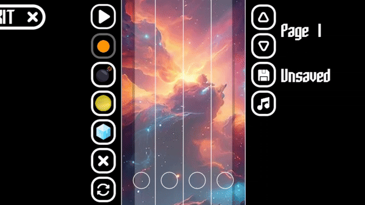
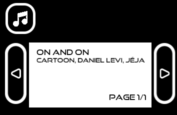
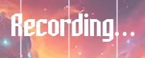

# Editor Guide
The editor may seem difficult to use, but it is actually quite simple to understand. Each button gives general understanding for what it might do based on its appearance alone.

## Beat placer


The beat placer is the most important function in the entire editor, it allows you to place beats above any of the circles along the bottom for the player to hit and earn score from. 

Beats have 2 main properties, time, and trail. Time just dictates at what time the beat comes onto the screen, this is automatically calculated for you by the editor using this equation (i know, it hurts my brain too)

```lua
local time = ((((460 - (circleRadius * 2)) - y)/(460 - (circleRadius * 2))) * 2.5) + ((page-1) * 2.5)
```
Basically, it gets the position of the circles and subtracts it from the position of your mouse (extremly oversimplified)

The second property, trail, is something which you will need to do yourself. To place a beat with a trail, you will need to place a beat (don't release your click) and drag your cursor back to spawn a trail

*Be careful, when 2 trails are placed next to eachother, they will link.*



Congratulations, you now know how to place beats! But that isn't all the editor has to offer!

## Powerups and Hazards


Not only can you place beats, you can also place powerups that give special abilities, and hazards which will take away from the player's score. Powerups only work when playing your level from the levels tab, not in playtest mode. Placing powerups and hazards is exactly the same as placing a beat, but you cannot put a trail on them.

### Powerups
"Golden Beat" - Double score for 7 seconds

"Ice Cube" - 75% speed for 5 seconds
### Hazards
"Bomb" - Lose 2000 score

## Editor Tools


Beats are great and all, but if you don't know how to control the actual editor itself, then you won't have the best time creating levels

### Page Switchers
The two top arrows are used for switching between pages, each page spans 2.5 seconds and moving between them will only show you beats from that time period. The page you are on is shown right next to the buttons, formatted as "Page {page}"


### Save
The save button is how you can store the contents of your level in a file to access later. If you opened a file, the text next to the save button might say the name of the file it will save to, otherwise it will read "Unsaved"

The name of the file is "Level {amount of files in save directory + 1}," but after you save it, you can change the file name youself.

Editor files are always saved in `%appdata%/LOVE/rhythm-game-levels` as `.rhythm` files


### Music
This is probably the most important editor button (aside from beat placer), I mean, it's called a rhythm game for a reason.

The music selector allows you to select a song from the 3 main levels. Want more to choose from? Make your own level and submit it on the [repository](https://github.com/29cmb/Love2DRhythmGame).



### Record


The record tool allows you to record your inputs and save them to the level data (to act out the level)


This is the best way to make your levels, as you can hear the music while creating it. All other tools can be used to fine-tune your levels. When you are recoding, you will see this label

